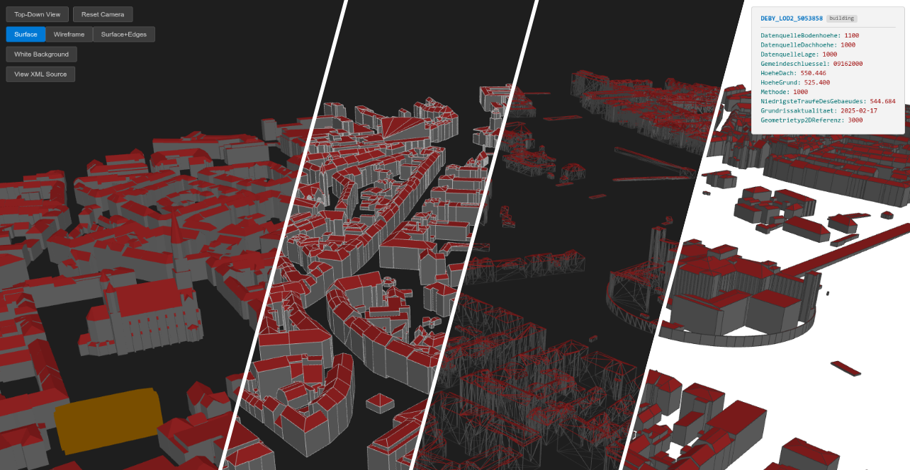

# CityGML LoD2 Viewer

A VSCode extension that opens CityGML Level-of-Detail 2 (LoD2) files directly as an interactive 3D scene — no external tools required.

## Features

- **3D WebGL rendering** — buildings, bridges, and tunnels appear automatically when you open any `.gml` file
- **Surface colours** — walls grey, roofs red, ground surfaces dark grey; bridges in sandy brown, tunnels in slate
- **Render modes** — switch between Surface (shaded), Wireframe, and Surface+Edges
- **Background toggle** — switch between dark and white background
- **Orbit navigation** — left-drag to rotate, right-drag to pan, scroll to zoom
- **Top-down view** — toggle switches to an orthographic plan view (pan + zoom only)
- **Click to inspect** — click any surface to highlight the whole object orange and display its `gml:id` and all `gen:stringAttribute` properties in a side panel
- **Deselect** — click the selected object again to clear the selection (dragging to orbit never triggers a deselect)
- **Switch to text** — "View XML Source" button opens the file as plain text; right-click the tab → **Reopen with CityGML 3D Viewer** to switch back

## Usage

1. Open a folder containing a `.gml` CityGML file in VSCode
2. Click the file in the Explorer — the 3D viewer opens automatically as a custom editor tab
3. Use the toolbar buttons at the top-left to control the view:
   - **Row 1** — Top-Down View / Reset Camera
   - **Row 2** — Surface / Wireframe / Surface+Edges render mode
   - **Row 3** — White Background toggle
   - **Row 4** — View XML Source
4. Click any surface to see its properties in the panel at the top-right

If a `.gml` file opens as plain text instead, right-click the file → **Open With…** → **CityGML 3D Viewer**.  
To switch back from text to the viewer, right-click the editor tab → **Reopen Editor With…** → **CityGML 3D Viewer**, or use the command palette: `CityGML: Open 3D Viewer`.

## Keyboard shortcuts

| Action | Windows / Linux | macOS |
|---|---|---|
| Open 3D Viewer for active `.gml` file | `Ctrl+Shift+V` | `Cmd+Shift+V` |

## Supported format

The extension targets **CityGML 1.0 / 2.0** files with LoD2 geometry. Both explicit namespace prefixes (e.g. `core:CityModel`) and default-namespace variants (e.g. `<CityModel xmlns="...">`) are supported.

| Feature type | Tag prefix | Notes |
|---|---|---|
| Buildings | `bldg:` | `lod2MultiSurface`; `BuildingPart` sub-elements supported |
| Bridges | `brid:` | Uniform colour (sandy brown) |
| Tunnels | `tun:` | Uniform colour (slate) |

Surface types recognized: `WallSurface`, `RoofSurface`, `GroundSurface`, `ClosureSurface`.  
Generic attributes (`gen:stringAttribute`) are shown in the properties panel.

## Performance

The viewer is designed to handle large real-world datasets. All geometry of the same material type is merged into a single draw call, so frame rate stays consistent regardless of how many buildings are in the scene. Parsing runs inside the webview rather than the extension host, so VS Code remains responsive while large files load.

## Requirements

VSCode 1.85 or later. No additional runtime required — the parser and renderer run entirely inside VSCode.

## Release Notes

See [CHANGELOG](CHANGELOG.md).
